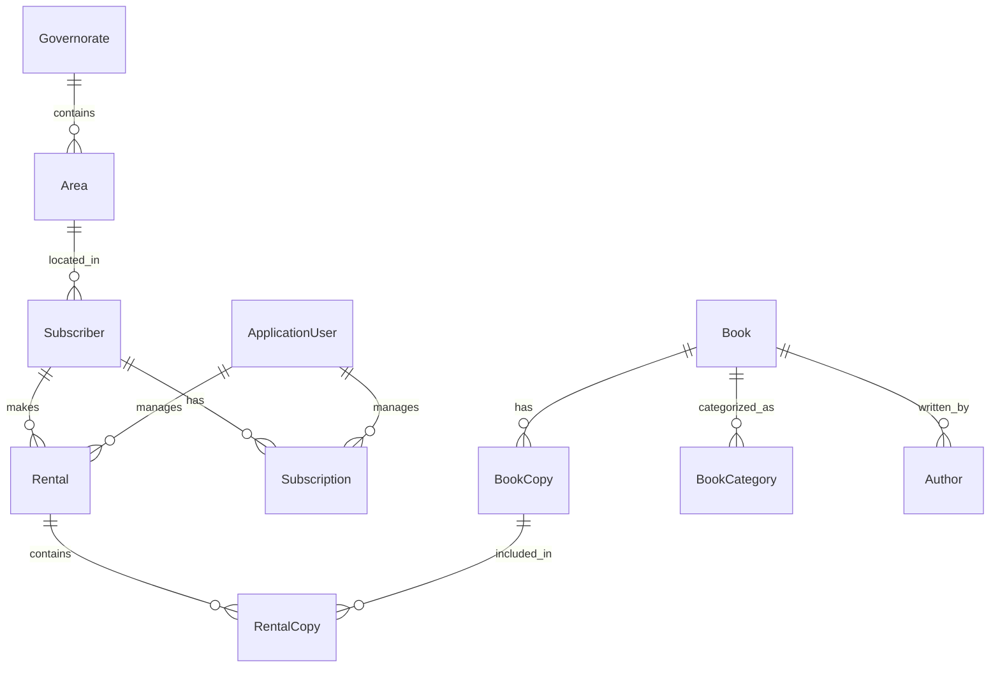

# 📚 Bookify

*Bookify* is a complete *Library Management System* developed using *ASP.NET MVC*.  
It aims to simplify the management of books, subscribers, rentals, and users in an organized and user-friendly way.

---

## 🧠 Project Idea

*Bookify* enables library administrators to manage all daily operations such as:
- Managing books and their copies  
- Registering authors and subscribers  
- Tracking rentals and returns  
- Sending email notifications  
- Managing user roles and permissions  

---

## 🗂 Main Modules

### 📘 Books
- Add / edit / delete books  
- Allow or restrict rentals  
- Manage copies of each book  
- View rental history of every copy  

### 📂 Categories
- Add / edit / delete categories  
- Assign books to specific categories  
- Filter and search books by category

### 🧑‍💻 Authors
- Add new authors  
- Update author information  

### 🙋 Subscribers
- Add new subscribers  
- Send welcome emails automatically  
- Update subscriber information  
- Block subscribers who violate rules  
- View subscriber profiles and rental history  

### 🔄 Rentals
- Create new rental records  
- Send rental confirmation emails  
- Update or cancel rentals  
- Register book returns  
- Send reminder emails before due dates  
- Record late fees and penalties  

### 🔐 User Management
- Add new users  
- Edit or delete existing users  
- Manage user roles and permissions  

### 🔍 Search
- Search for books, authors, or subscribers easily  

---

## ⚙ Tech Stack

### 🧩 Backend & Core
- *ASP.NET Core 8 (MVC)*  
- *Entity Framework Core (SQL Server)*  
- *ASP.NET Core Identity* (role-based authentication & authorization)  
- *Hangfire* (background jobs & scheduling)  
- *Serilog* (structured logging)  
- *AutoMapper* (object mapping)  
- *Clean Architecture*  

### 🎨 Frontend
- *Bootstrap 5*  
- *AJAX* (asynchronous requests and partial updates)  
- *jQuery, **Bootbox.js, **Animate.css, **Typeahead.js, **Handlebars.js*  

### 🌐 Integrations
- *Cloudinary* – image storage  
- *ClosedXML* – Excel export  
- *OpenHtmlToPdf* – PDF export  
- *WhatsAppCloudApi* – notification system  
- *SixLabors.ImageSharp* – image processing  
- *ExpressiveAnnotations* – advanced validation rules

---

### **Entity Relationship Diagram (Simplified)**

## 🚀 How to Run

1. Open the project in *Visual Studio 2022* or later  
2. Update the database connection string inside:
   
   appsettings.json
   
3. From the *Package Manager Console*, run:
   
   update-database
   
4. Press *F5* to run the project  
5. Open your browser and navigate to the shown local URL, e.g.:
   
   https://localhost:xxxx

---

## 🧩 Project Structure

Bookify/
│
├── Bookify.Web/            # Presentation layer (Controllers, Views, wwwroot)
├── Bookify.Application/    # Application services (Services, DTOs)
├── Bookify.Domain/         # Domain entities and core business logic
├── Bookify.Infrastructure/ # Data access layer (EF Core, Repositories)
├── Bookify.sln             # Solution file
└── README.md               # Project documentation

## 🌟 Future Improvements
- RESTful API for mobile integration  
- AI(Recommendation Books, Support) 
- Enhanced UI/UX with modern components  

---

## 🪪 License
This project is licensed under the *MIT License* – see the [LICENSE]([LICENSE](https://opensource.org/licenses/MIT)) file for details.

---

## 📬 Contact

*Developed by:* Salem Mosaad Gomaa  
*GitHub:* [@SalemMG10](https://github.com/SalemMG10)  
*Email:* Salemgomaa@gmail.com  
*LinkedIn:* [[Salem Gomaa](https://www.linkedin.com/in/salem-gomaa-9864632a6)]

---

⭐ If you like this project, don’t forget to star the repo!
   
